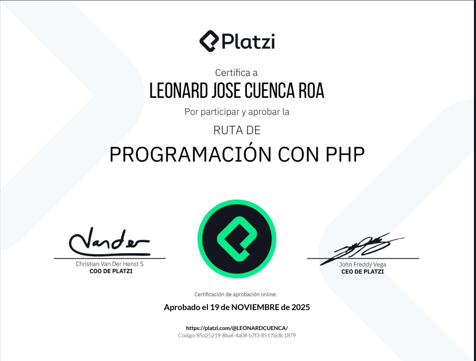
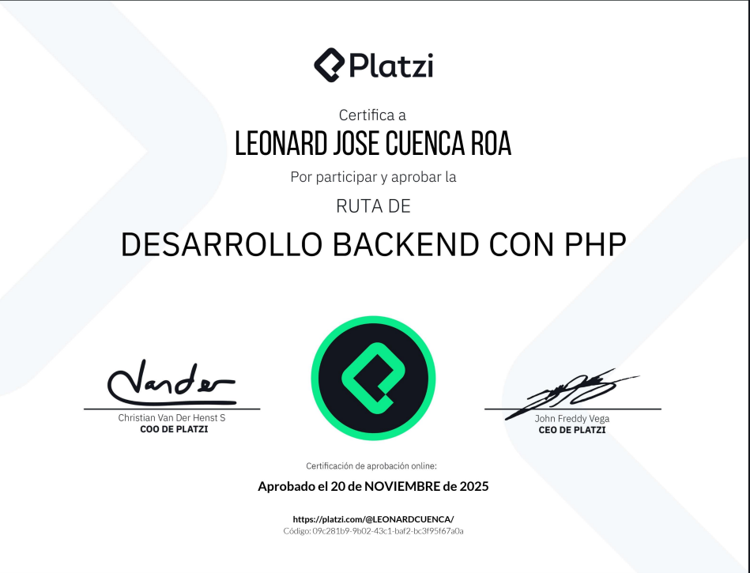

# 🐘 PHP Backend Web Development Journey

## 🚀 About This Repository

As part of my initiative to accelerate my professional growth, this repository documents my comprehensive journey through the **PHP & Laravel ecosystem**. This creates "LeoSan Professional Version 4.0".

Based on the philosophy of *unlearning to relearn*, I revisited the foundations to build a stronger, more modern architecture of knowledge, aligned with industry best practices.

---

## 📚 Learning Roadmap

### 🟢 Basic Level: Foundations
| Course Name | Technologies | Certification |
| :--- | :---: | :---: |
| **Introducción a PHP con Composer** | PHP, Composer | [🎓 View](https://github.com/LeoSan/DesarrolloWebBackendPHP_PLATZI_2021/blob/main/01_Basico/00_Curso_Introducci%C3%B3nPHPComposer/Examen/2021_Diploma-php_composer_platzi.pdf) |
| **Manejo de Datos en PHP** | Arrays, Strings | [🎓 View](https://github.com/LeoSan/DesarrolloWebBackendPHP_PLATZI_2021/blob/main/01_Basico/01_CursoManejoDatosPHP/Examen/2021_Diploma-datos-php_2021.pdf) |
| **Programación Orientada a Objetos (POO)** | OOP, Classes | [🎓 View](https://github.com/LeoSan/DesarrolloWebBackendPHP_PLATZI_2021/blob/main/01_Basico/02_Curso_ProgramacionOrientadaObjetosPHP/Examen/2021_Diploma-php-poo_PLATZI.pdf) |
| **Introducción a Frameworks PHP** | MVC, Design | [🎓 View](https://github.com/LeoSan/DesarrolloWebBackendPHP_PLATZI_2021/blob/main/01_Basico/03_Curso_Introduccion_Frameworks_PHP/Examen/2021_Diploma-php-frameworks_PLATZI.pdf) |
| **Introducción al Desarrollo Backend** | HTTP, Servers | [🎓 View](https://github.com/LeoSan/DesarrolloWebBackendPHP_PLATZI_2021/blob/main/01_Basico/04_CursoIntroduccionDesarrolloBackend/Examen/2021_Diploma-introduccion-backend_PLATZI.pdf) |

### 🟡 Intermediate Level: Laravel Ecosystem
| Course Name | Focus | Certification |
| :--- | :---: | :---: |
| **Introducción a Laravel** | Routing, MVC | [🎓 View](https://github.com/LeoSan/DesarrolloWebBackendPHP_PLATZI_2021/blob/main/02_Intermedio/01_Curso_Introduccion_Laravel/Examen/Diploma-intro-laravel-2020.pdf) |
| **Manejo de Datos con Eloquent ORM** | DB, Models | [🎓 View](https://github.com/LeoSan/DesarrolloWebBackendPHP_PLATZI_2021/blob/main/02_Intermedio/02_CursoBasicoManejoDatosLaravelEloquentORM/Examen/2021_Diploma-eloquent-laravel.pdf) |
| **Introducción a Laravel 8** | New Features | [🎓 View](https://github.com/LeoSan/DesarrolloWebBackendPHP_PLATZI_2021/blob/main/02_Intermedio/03_Curso_Introduccion_Laravel_8/Examen/2021_Diploma-intro-laravel-platzi.pdf) |

### 🔴 Advanced Level: Architecture & APIs
| Course Name | Specialization | Certification |
| :--- | :---: | :---: |
| **Curso Renovado PHP (2024)** | Modern PHP | [🎓 View](https://github.com/LeoSan/DesarrolloWebBackendPHP_PLATZI_2021/03_Avanzado/12_Curso_Renovado_PHP_2024/2024_diploma-web-php_platzi.pdf) |
| **API REST con PHP** | Pure PHP | [🎓 View](https://github.com/LeoSan/DesarrolloWebBackendPHP_PLATZI_2021/blob/main/03_Avanzado/01_CursoAPI_REST/Examen/2021_Diploma-api-rest_PLATZI.pdf) |
| **API REST con Laravel** | Resources, Auth | [🎓 View](https://github.com/LeoSan/DesarrolloWebBackendPHP_PLATZI_2021/blob/main/03_Avanzado/02_CursoAPI_REST_Laravel/Examen/2021_diploma-laravel-api-Platzi.pdf) |
| **Laravel 8 Avanzado** | Advanced logic | [🎓 View](https://github.com/LeoSan/DesarrolloWebBackendPHP_PLATZI_2021/blob/main/03_Avanzado/03_Laravel_8_Avanzado/Examen/2021_Diploma-laravel-avanzado_PLATZI.pdf) |
| **Despliegue de Aplicaciones** | CI/CD, Deploy | [🎓 View](https://github.com/LeoSan/DesarrolloWebBackendPHP_PLATZI_2021/blob/main/03_Avanzado/04_%20Curso_IntroduccionDespliegueAplicaciones/Examen/2021_Diploma-despliegue-apps_PLATZI.pdf) |
| **Test Driven Development (TDD)** | Testing | [🎓 View](https://github.com/LeoSan/DesarrolloWebBackendPHP_PLATZI_2021/blob/main/03_Avanzado/05_Curso_DesarrolloLaravelTestDrivenDevelopment/Examen/2021_Diploma-laravel-tdd_PLATZI.pdf) |
| **PHP Laravel** | Deep Dive | [🎓 View](https://github.com/LeoSan/DesarrolloWebBackendPHP_PLATZI_2021/blob/main/03_Avanzado/08_Curso_PHPLaravel/Examen/2021_Diploma-curso-php-laravel-platzi.pdf) |
| **Curso Avanzado de PHP** | Core Concepts | [🎓 View](https://github.com/LeoSan/DesarrolloWebBackendPHP_PLATZI_2021/blob/main/03_Avanzado/10_CursoAvanzadoPHP/Examen/2021_Diploma-php-avanzado_PLATZI.pdf) |

---

## 🏆 Major Milestones

### Global Certifications
| Milestone | Description | View |
| :--- | :--- | :---: |
| **Platzi Career Certificate** | Full Backend Development Career | [📜 Diploma](https://github.com/LeoSan/DesarrolloWebBackendPHP_PLATZI_2021/blob/main/2021_Diploma-Carrera-backend_php_PLATZI.pdf) |
| **Ruta 2024 Knowledge Update** | Latest PHP Standards & Practices | [📜 Diploma](https://github.com/LeoSan/CursosBackendPHP/blob/main/03_Avanzado/12_Curso_Renovado_PHP_2024/2024_diploma-web-php_platzi.pdf) |
| **Ruta 2025 Knowledge Update** | Latest PHP Standards & Practices | [📜 Diploma](https://github.com/LeoSan/CursosBackendPHP/blob/main/03_Avanzado/14_Curso_Ruta_Renovada_2025/2025_diploma-programacion-con-php_PLATZI.pdf) |
| **Develop Backend con PHP 2025 Knowledge Update** | Latest PHP Standards & Practices | [📜 Diploma](https://github.com/LeoSan/CursosBackendPHP/blob/main/03_Avanzado/15_DesarrolloBackendPHP_2025/2025_Diploma-desarrollo-backend-con-php_PLATZI.pdf) |

  
  
  
  

> *Note: Some images represent the culmination of the learning paths.*

